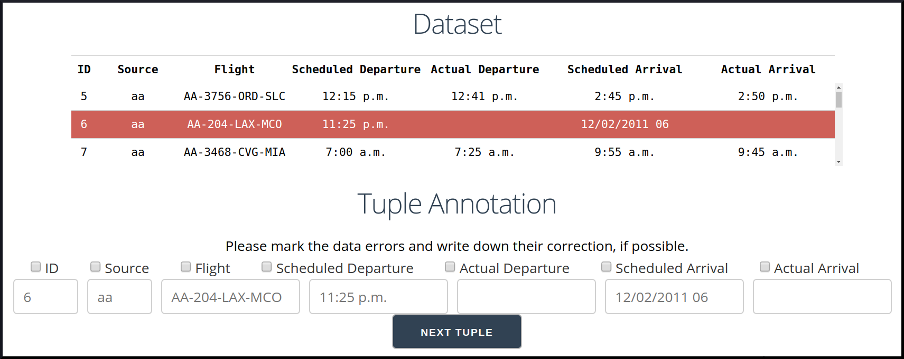
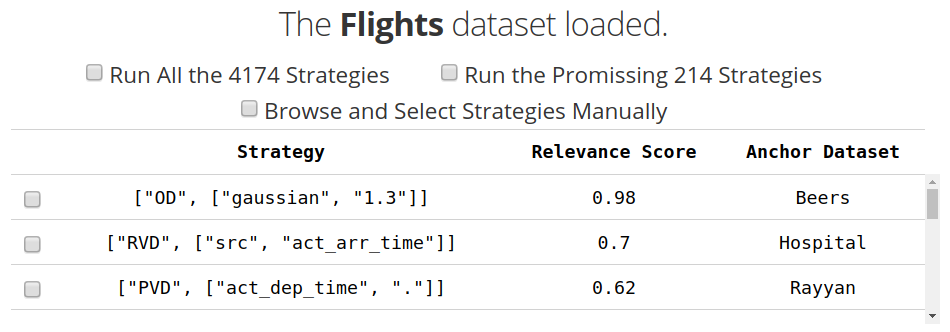
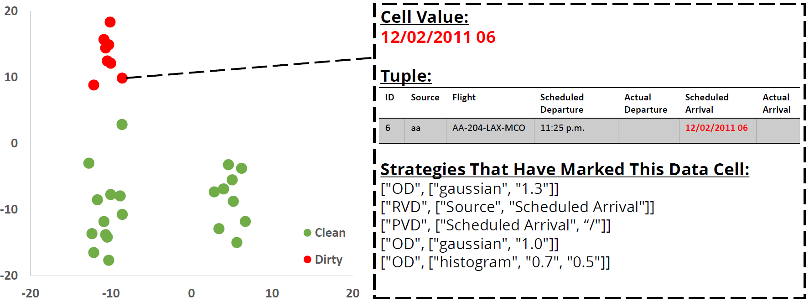
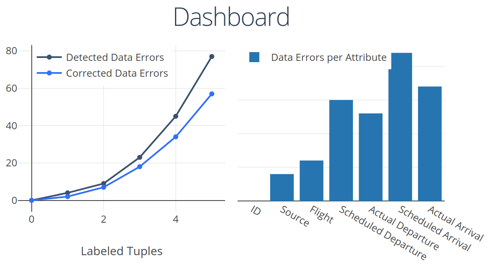

# Raha and Her Younger Sister Baran
Detecting and correcting erroneous values are key steps in data cleaning. Error detection/correction systems usually require a user to provide input configurations in the form of integrity constraints or statistical parameters. However, providing a complete, yet correct, set of configurations for each new dataset is tedious and error-prone, as the user has to know about both the dataset and the data cleaning system upfront.

Raha and Baran are new configuration-free error detection and correction systems, respectively. On an abstract level, both Raha and Baran follow the same novel two-step formulation of the error detection/correction task that achieves both high precision and recall. First, each base error detector/corrector generates an initial set of potential data errors/corrections. This step particularly increases the achievable recall bound of the error detection/correction task. Then, Raha/Baran ensembles the output of these base error detectors/correctors into one final set of data errors/corrections in a semi-supervised manner. In fact, Raha/Baran iteratively asks the user to annotate a tuple, i.e., marking/fixing a few data errors. Raha/Baran learns to generalize the user-provided error detection/correction examples to the rest of dataset, accordingly. This step particularly preserves high precision of the error detection/correction task. Furthermore, both systems can leverage historical data to optimize the data cleaning task on the dataset at hand, according to transfer learning. 


## Installation
To install Raha and Baran, you can run:
```console
pip3 install raha
```
To uninstall them, you can run:
```console
pip3 uninstall raha
```

## Usage
Running Raha and Baran is simple!
   - **Benchmarking**: If you have a dirty dataset and its corresponding clean dataset and you want to benchmark Raha and Baran, please check the sample codes in `raha/benchmark.py`, `raha/detection.py`, and `raha/correction.py`.
   - **Interactive data cleaning with Raha and Baran**: If you have a dirty dataset and you want to interatively detect and correct data errors, please check our interactive Jupyter notebooks in the `raha` folder. The Jupyter notebooks provide graphical user interfaces.
      
      
      
    

## References
You can find more information about this project and the authors [here](https://dl.acm.org/doi/abs/10.1145/3299869.3324956) and [here](https://dl.acm.org/doi/abs/10.14778/3407790.3407801). You can also use the following bib entries to cite this project and the corresponding research papers.

### Citing Raha
```
@inproceedings{mahdavi2019raha,
  title={Raha: A configuration-free error detection system},
  author={Mahdavi, Mohammad and Abedjan, Ziawasch and Castro Fernandez, Raul and Madden, Samuel and Ouzzani, Mourad and Stonebraker, Michael and Tang, Nan},
  booktitle={Proceedings of the International Conference on Management of Data (SIGMOD)},
  pages={865--882},
  year={2019},
  organization={ACM}
}
```

### Citing Baran
```
@article{mahdavi2020baran,
  title={Baran: Effective error correction via a unified context representation and transfer learning},
  author={Mahdavi, Mohammad and Abedjan, Ziawasch},
  journal={Proceedings of the VLDB Endowment (PVLDB)},
  volume={13},
  number={11},
  pages={1948--1961},
  year={2020},
  publisher={VLDB Endowment}
}
```


## A Note on the Naming
Raha and Baran are Persian feminine names that are conceptually related to their corresponding error detection/correction systems. Raha (which means "free" in Persian) is assigned to our "configuration-free" error detection system. Baran (which means "rain" in Persian and rain washes/cleans everything) is assigned to our error correction system that "cleans" data.
